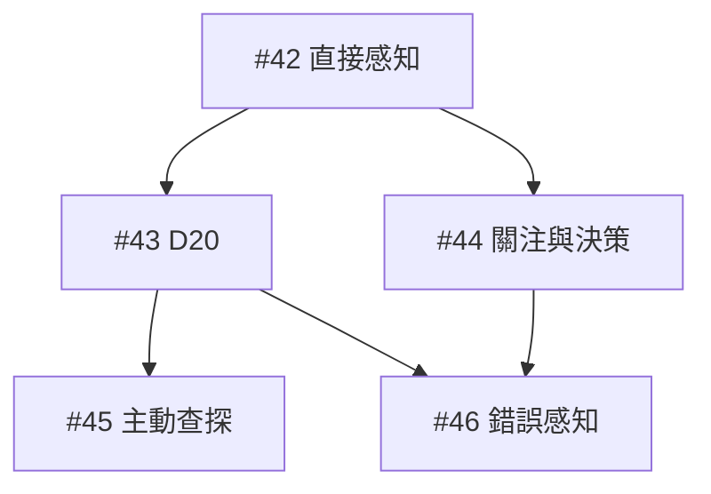

# 感知 PoC 工作拆分

狀態：使用者於 2026-10-10 確認拆分，5 張工作票已發布並標記 ready-for-agent。尚未實作。
父規格：[Issue #41](https://github.com/sarekoubeYohane/quiet-hours-npc/issues/41)
日期：2026-10-10

## 已發布工作票

| 工作票 | 直接阻擋 | 可驗收的交付 |
| --- | --- | --- |
| [#42 T1：咖啡館直接感知與知情隔離](https://github.com/sarekoubeYohane/quiet-hours-npc/issues/42) | 無，可先開始 | 在前台／儲藏室移動及開關門後，不同角色只收到各自可直接看見／聽見的內容，使用者能展開比較。 |
| [#43 T2：不確定線索的 D20 與結果保存](https://github.com/sarekoubeYohane/quiet-hours-npc/issues/43) | [#42](https://github.com/sarekoubeYohane/quiet-hours-npc/issues/42) | 同一事件下，角色依環境、能力與注意力取得清楚、模糊或沒有新線索的結果，重載仍維持同一結果。 |
| [#44 T3：關注條件與每輪決策上限](https://github.com/sarekoubeYohane/quiet-hours-npc/issues/44) | [#42](https://github.com/sarekoubeYohane/quiet-hours-npc/issues/42) | NPC 一般收到線索時可繼續活動，相關或重要線索才提前評估；同輪多事件也最多一次模型行動決策。 |
| [#45 T4：主動查探與有效重試](https://github.com/sarekoubeYohane/quiet-hours-npc/issues/45) | [#43](https://github.com/sarekoubeYohane/quiet-hours-npc/issues/43) | 角色聽見動靜後可查看、聆聽、開門或靠近取得新線索；持續查看及重複相同方法不能刷骰。 |
| [#46 T5：情境優先的錯誤感知與自然反應](https://github.com/sarekoubeYohane/quiet-hours-npc/issues/46) | [#43](https://github.com/sarekoubeYohane/quiet-hours-npc/issues/43)、[#44](https://github.com/sarekoubeYohane/quiet-hours-npc/issues/44) | 大失敗可讓角色誤聽／誤看，或感覺到不存在的刺激；依期待加權隨機選取，並能影響角色既有關注與反應。 |

目前可以開始 #42。#43／#44 在依賴上互不阻擋；#45 不必等 #44，#46 不必等 #45。各票只有在全部阻擋票完成後才能開始。

目前連接器未提供原生子工作票／阻擋關係寫入，且本機無可用 gh；依專案替代規則，每張票以 Part of #41 及 Blocked by 真實 Issue 編號記錄關係。這些是文字關係，未建立 GitHub 原生父子／阻擋連結。

## 拆分與驗收原則

- 每張票完成可從世界操作、保存、角色決策輸入到畫面驗收的完整行為；保存、資訊隔離與接管相容隨切片交付。
- 沒有獨立的廣泛機械重構前置票；#42 起始完成必要的小型責任整理並保持既有行為。
- 33 條父規格使用者故事均有工作票涵蓋，直接阻擋圖無循環。
- 每票沿用世界 API、模型服務替身及固定亂數（適用時），補少量新增畫面驗收；完成 #46 後核對跨票情境。
- 發布驗證確認 5 張票內容與標籤、文字父規格／阻擋關係及舊票關閉狀態；未執行產品功能測試，尚未開始實作。

## 舊票處理結果

| 舊票 | 承接工作票 | 狀態 |
| --- | --- | --- |
| #14 直接觀察 | #42、#45 | 已附取代說明，closed / not_planned |
| #15 不確定觀察 | #43、#44、#45 | 已附取代說明，closed / not_planned |
| #17 錯誤認知 | #46 | 已附取代說明，closed / not_planned |
| #16 主觀記憶分類 | 留待 Memory & Belief | 保持 open、設計暫停 |
| #18 信念修正 | 留待 Memory & Belief | 保持 open、設計暫停 |

關閉舊票表示新規格取代早期草稿，不表示功能已實作。父規格 #7／#41 未修改或關閉；新感知工作不依賴待重新 Grill 的 Memory & Belief 票。

## 已發布工作票內容

### [T1：咖啡館直接感知與知情隔離](https://github.com/sarekoubeYohane/quiet-hours-npc/issues/42)

#### Parent

Part of #41（[NPC 感知規格](https://github.com/sarekoubeYohane/quiet-hours-npc/issues/41)）。

#### What to build

在前台／儲藏室移動及開關門後，不同角色只收到各自可直接看見／聽見的內容，使用者能展開比較。

首票只完成直接可得線索的完整路徑；不確定線索的 D20 判定在 T2，選擇性關注在 T3。必要的小型責任整理在本票開始時完成並維持既有行為，不另開純重構或資料層工作票。

#### Acceptance criteria

- [ ] 提供可替換的前台、儲藏室及門設定，其他場所維持單區域；舊世界補足預設區域與門狀態，無歷史補發。
- [ ] 角色與接管中的使用者可經既有操作入口移動區域、開關門；操作經世界驗證後更新狀態，非法操作與自由敘述不能偷偷改變場景。
- [ ] 已確認事件、進入區域與相關場景變化只處理可能接觸線索的角色；明顯視覺與聽覺直接察覺且不擲骰。
- [ ] 角色隔門聽到動靜不等於看見來者或知道原因；主觀內容具有感官、線索類型、時間與角色可知來源，供後續工作延伸。
- [ ] 所有新感知內容送往模型、既有記憶與接管經歷時均使用角色自己的觀察；對話、私人訊息、私密內心與指定介入維持知情隔離。
- [ ] 保存觀察與同次事件處理紀錄；重載不重送，未察覺的世界變化不改寫舊觀察。最小觀察保存不等於實作長期 Memory & Belief。
- [ ] 接管／待命期間照常保存主觀觀察，由使用者選擇行動；交還不補發未知事件，後續決策能取得實際經歷。
- [ ] 介面提供必要區域／門操作與簡潔狀態，並可展開本票直接感知詳情：哪些角色看見、只聽見或沒有感知機會；詳情不增加模型呼叫。
- [ ] 使用世界 API＋模型服務替身驗證門開關的知情差異、保存後讀取、舊世界、接管交還與隱藏資訊不進入 NPC 請求；補少量必要畫面驗收。
- [ ] 延續世界原子保存與失敗回復，新增場景與觀察不能半套提交；在本票完成後既有行動、控制與持續活動測試仍通過。

#### Blocked by

None (can start immediately).

#### Further notes

- 對應父規格使用者故事：1、2、3、4、9、10、26、27、28、29、30、31、32、33。
- [已確認工作拆分](https://github.com/sarekoubeYohane/quiet-hours-npc/blob/docs/perception-grill-20261010/docs/design/npc-perception-ticket-plan.md)。每個阻擋工作完成後才可開始本票。
- 目前連接器未提供原生子工作票／阻擋關係寫入，依專案規則使用上述 Parent 與 Blocked by 欄位。
- 本票建立不代表已實作、部署或進行付費模型試跑。

### [T2：不確定線索的 D20 與結果保存](https://github.com/sarekoubeYohane/quiet-hours-npc/issues/43)

#### Parent

Part of #41（[NPC 感知規格](https://github.com/sarekoubeYohane/quiet-hours-npc/issues/41)）。

#### What to build

同一事件下，角色依環境、能力與注意力取得清楚、模糊或沒有新線索的結果，重載仍維持同一結果。

此票驗證事件觸發的不確定感知與基本同次去重。主動查探產生新的有效機會由 T4 補足；不是把保存留到後續橫向工作。

#### Acceptance criteria

- [ ] 同一角色、同次有效機會的不確定線索綜合擲骰一次；明顯線索不骰，無感知機會不骰。
- [ ] 沿用現有 DC 8／12／16、修正 −4／−2／0／2／4 與五級門檻；場景影響難度，相關能力與活動注意力影響修正，相同因素不重複計入。
- [ ] 能力採受控標籤對照，無關或未配置為 0；模型不能臨時發明能力。環境與多感官的具體條件依 #41 的 PoC 預設。
- [ ] 大成功／成功只給可接觸的較清楚內容，部分成功給片段，普通失敗不向被動觀察者提示漏掉事件；已直接察覺內容不能被失敗撤回。
- [ ] 本票的大失敗保留判定且沒有新收穫；完整錯誤感知候選由 T5 接入，不先強迫虛構結果。
- [ ] 保存以角色、事件／線索及有效條件識別的機會與判定；相同條件、回合推進、無關場景變化與重新載入都不重骰或重複觀察。
- [ ] 主觀內容進入角色後續決策；骰點、DC、隱藏來源與判定診斷只在觀察者詳情顯示，無機會與有機會但未察覺分開呈現。
- [ ] 世界 API 固定亂數驗證五級結果、單次綜合判定、能力與注意力差異、跨感官資訊上限、重載不重擲及模型輸入隔離。
- [ ] 模型失敗或儲存衝突時，判定與觀察跟隨世界一致回復，沿用既有已付模型用量保留；不為感知新增模型呼叫。

#### Blocked by

- #42（T1：咖啡館直接感知與知情隔離）

#### Further notes

- 對應父規格使用者故事：5、6、7、8、11、12、25、29、30、31。
- [已確認工作拆分](https://github.com/sarekoubeYohane/quiet-hours-npc/blob/docs/perception-grill-20261010/docs/design/npc-perception-ticket-plan.md)。每個阻擋工作完成後才可開始本票。
- 目前連接器未提供原生子工作票／阻擋關係寫入，依專案規則使用上述 Parent 與 Blocked by 欄位。
- 本票建立不代表已實作、部署或進行付費模型試跑。

### [T3：關注條件與每輪決策上限](https://github.com/sarekoubeYohane/quiet-hours-npc/issues/44)

#### Parent

Part of #41（[NPC 感知規格](https://github.com/sarekoubeYohane/quiet-hours-npc/issues/41)）。

#### What to build

NPC 一般收到線索時可繼續活動，相關或重要線索才提前評估；同輪多事件也最多一次模型行動決策。

只依賴 T1 提供的主觀觀察，不需要 D20 才能驗證關注及成本規則，所以不把 T2 設為阻擋。T5 會驗證錯誤感知也能通過同一入口。

#### Acceptance criteria

- [ ] NPC 在既有決策中與意圖佇列一起提供有限關注條件，最多 12 條，只能引用可知對象與區域；不新增獨立事件 queue 或額外生成呼叫。
- [ ] 驗證模型格式與條件類型／目標；整體格式不合法沿用既有失敗流程，單條未知或越界條件捨棄並保留其他有效輸出。舊世界預設空條件。
- [ ] 以角色收到的主觀線索匹配，不能從原始世界事件取得隱藏身分；等 Vera 且只聽見未知腳步不能直接匹配 Vera。
- [ ] 一般無關線索保存後等待正常決策；符合關注條件或已察覺的危險、強刺激、直接互動可提前重新評估。
- [ ] 提前評估時 NPC 取得性格、意圖、活動進度與主觀觀察，自行選擇續做或改做；原活動續做不重啟、不重複記憶。
- [ ] 每個角色每輪最多一次模型行動決策；已決策後到達的線索（含重大危險）留到下一輪，感知仍繼續。
- [ ] 保存決策使用進度與尚未處理的觀察，最近記憶截斷不能丟失晚到線索；失敗回合與保存衝突不能錯誤標記已使用。
- [ ] 接管與待命角色不因重要線索自動行動；交還後依主觀經歷重新評估，仍遵守一次上限。
- [ ] 感知詳情可呈現為何提前評估或留待下次，直接讀取紀錄；不把診斷傳給 NPC，不新增模型說明呼叫。
- [ ] 以直接感知場景通過世界 API 驗證續做、切換、未知來源、無效條件、同輪多事件／晚到危險、重載後待用線索與實際模型呼叫數。

#### Blocked by

- #42（T1：咖啡館直接感知與知情隔離）

#### Further notes

- 對應父規格使用者故事：8、18、19、20、21、22、23、27、28、30、31。
- [已確認工作拆分](https://github.com/sarekoubeYohane/quiet-hours-npc/blob/docs/perception-grill-20261010/docs/design/npc-perception-ticket-plan.md)。每個阻擋工作完成後才可開始本票。
- 目前連接器未提供原生子工作票／阻擋關係寫入，依專案規則使用上述 Parent 與 Blocked by 欄位。
- 本票建立不代表已實作、部署或進行付費模型試跑。

### [T4：主動查探與有效重試](https://github.com/sarekoubeYohane/quiet-hours-npc/issues/45)

#### Parent

Part of #41（[NPC 感知規格](https://github.com/sarekoubeYohane/quiet-hours-npc/issues/41)）。

#### What to build

角色聽見動靜後可查看、聆聽、開門或靠近取得新線索；持續查看及重複相同方法不能刷骰。

T2 已間接包含 T1 的場景操作，故只列直接阻擋 T2。此票可由正常決策或使用者直接查探驗證，不必等待 T3 的提前中斷能力。

#### Acceptance criteria

- [ ] NPC 與接管中的使用者能經既有行動入口選擇主動查看／聆聽及有效目標，介面提供必要操作，使用與自主角色相同的世界驗證。
- [ ] 需要專注或移動的查探調整／暫停原活動並消耗既有世界時間；輕度留意不要求另開查探行動，也不新增第二次模型決策。
- [ ] 改變位置、有效觀察方式、開門或新增可接觸線索可產生新機會；已消失的聲音不能透過查探重聽。
- [ ] 延用 T2 的機會與條件識別，重複方法、換文字、原地持續觀察、來回切回已處理條件及重新載入不能刷骰。
- [ ] 主動查探無收穫可告知沒聽清／沒有新線索；不能因此揭露有隱藏事件，亦不能因內部知道先前骰失敗自動替角色選擇查探。
- [ ] 新結果隨世界保存並進入後續模型上下文與感知詳情，原先帶時間觀察保留；查探本身不重新寫入未觀察真相。
- [ ] 以世界 API 及固定亂數驗證動靜→主動查探→開門／靠近→新線索、有效／無效重試與消失線索；畫面能完成相同最小流程。
- [ ] 驗證查探耗時、接管行動、保存回復、重載與不新增感知模型呼叫，維持既有活動與動作邊界。

#### Blocked by

- #43（T2：不確定線索的 D20 與結果保存）

#### Further notes

- 對應父規格使用者故事：13、24、25、27、28、29、31。
- [已確認工作拆分](https://github.com/sarekoubeYohane/quiet-hours-npc/blob/docs/perception-grill-20261010/docs/design/npc-perception-ticket-plan.md)。每個阻擋工作完成後才可開始本票。
- 目前連接器未提供原生子工作票／阻擋關係寫入，依專案規則使用上述 Parent 與 Blocked by 欄位。
- 本票建立不代表已實作、部署或進行付費模型試跑。

### [T5：情境優先的錯誤感知與自然反應](https://github.com/sarekoubeYohane/quiet-hours-npc/issues/46)

#### Parent

Part of #41（[NPC 感知規格](https://github.com/sarekoubeYohane/quiet-hours-npc/issues/41)）。

#### What to build

大失敗可讓角色誤聽／誤看，或感覺到不存在的刺激；依期待加權隨機選取，並能影響角色既有關注與反應。

不依賴 T4：可用事件觸發的大失敗與 T3 關注流程獨立驗收。主動查探若存在也沿用同一感知結果入口，不另建錯誤系統。信念是否修正留待 Memory & Belief。

#### Acceptance criteria

- [ ] 在既有不確定感知的大失敗接入兩類可設定候選：扭曲現場線索，以及沒有對應外在刺激的主觀感受；不增加背景錯覺排程。
- [ ] 先依有效感官、當下情境與角色已有期待／關注資料篩選，再按情境優先的權重隨機選取；其他合理候選仍有可能，預設採 #41 的 3：1 權重。
- [ ] 假身分只取自角色本來認識／期待的人，不能讀取隱藏事件真實身分來挑選；不複製實際未聽清的私密話語。
- [ ] 無適用候選時只有大失敗診斷而沒有新線索；其他直接察覺的清楚內容不被撤回。
- [ ] 錯誤內容保存為角色主觀觀察，骰子與抽選結果重載不變；世界不新增對應人物、聲音來源、物證或其他真實事件。
- [ ] 錯誤主觀內容使用與普通觀察相同的關注／中斷流程；可促成重新評估但不強制相信或行動，每輪仍最多一次模型決策。
- [ ] NPC 模型輸入只含主觀內容及可知來源；觀察者詳情能辨識錯誤內容、真實情況與骰子結果，呈現不額外呼叫模型。
- [ ] 接管／待命時同樣保存錯誤主觀觀察但由使用者行動；交還不修正為全知真相，未察覺世界變化不改寫既有錯誤觀察。
- [ ] 以固定亂數及世界 API 驗證兩類候選、加權選取、無候選分支、未知真相隔離、保存重載不重抽，以及錯誤感知觸發／晚到下輪的行為。
- [ ] 沿用世界回合失敗與保存衝突規則，結果與使用進度一起提交；完成後進行 #41 所列跨票情境驗收，任何發現的缺口回到所屬切片修正。

#### Blocked by

- #43（T2：不確定線索的 D20 與結果保存）
- #44（T3：關注條件與每輪決策上限）

#### Further notes

- 對應父規格使用者故事：14、15、16、17、18、25、26、27、28、29、30、31。
- [已確認工作拆分](https://github.com/sarekoubeYohane/quiet-hours-npc/blob/docs/perception-grill-20261010/docs/design/npc-perception-ticket-plan.md)。每個阻擋工作完成後才可開始本票。
- 目前連接器未提供原生子工作票／阻擋關係寫入，依專案規則使用上述 Parent 與 Blocked by 欄位。
- 本票建立不代表已實作、部署或進行付費模型試跑。

